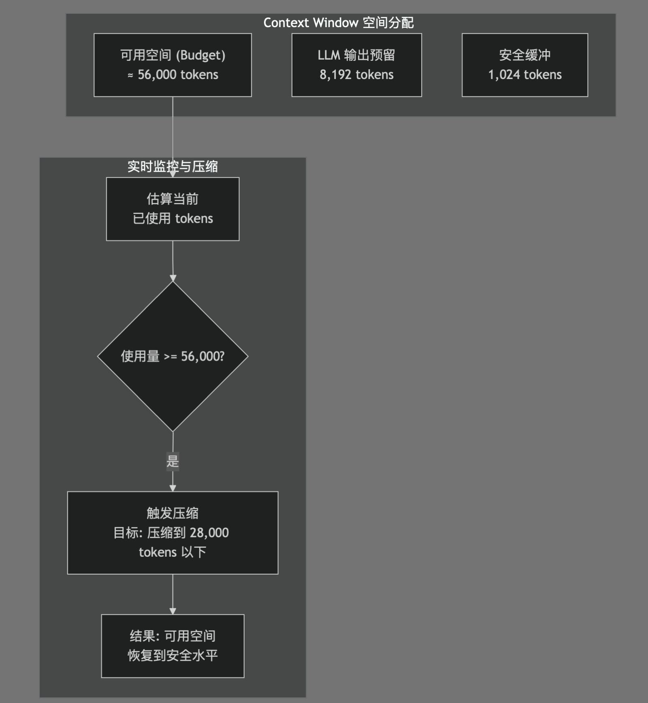
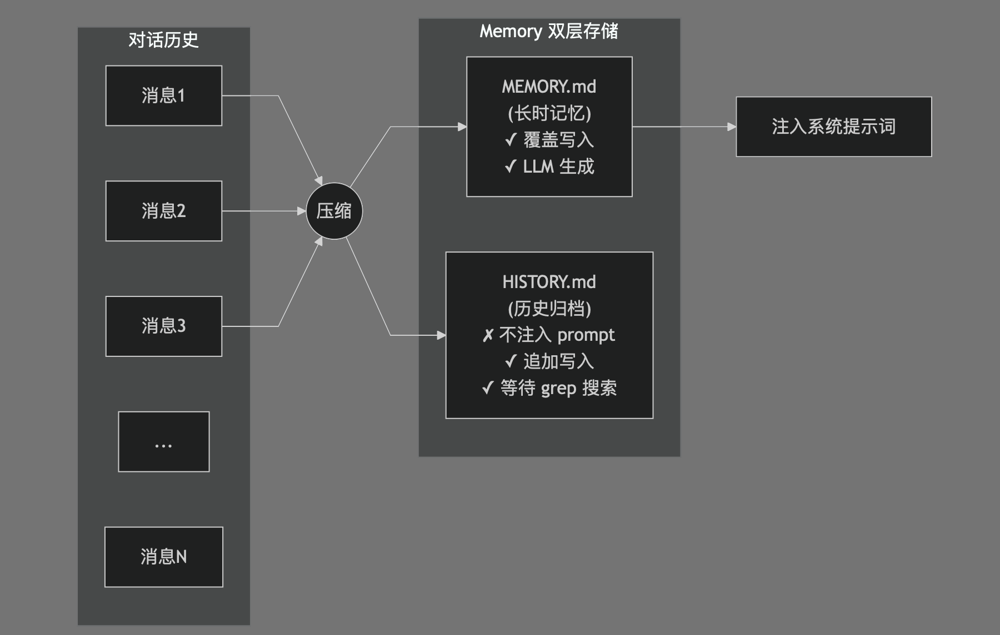
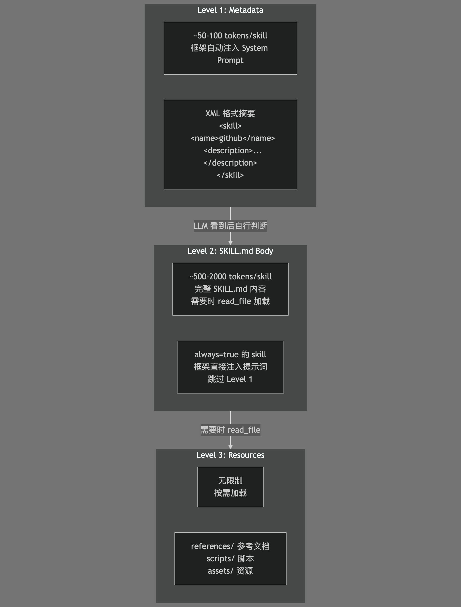

## 一、折腾开始

&emsp;&emsp;关注 AI Agent 领域也有一段时间了（每天高强度网上冲浪看看看），看着各种 Coding Agent 工具如雨后春笋般涌现。作为一个天天和游戏引擎打交道快要腐朽的"老东西"，我就在想：能不能把这些 Agent 的能力，直接搬到游戏引擎里？让 AI 不仅仅是个写代码的助手，而是成为游戏开发流程中真正的一部分？

&emsp;&emsp;于是就有了 Dora SSR Coding Agent——一个能跑在全平台游戏引擎中、帮助做游戏开发的 LLM Agent 功能。

## 二、为什么要在游戏引擎里做 Agent？

&emsp;&emsp;现在的 Coding Agent 工具大多跑在命令行或者 IDE 里，帮开发者写代码、改 bug。但是游戏开发有其特殊性：你需要不断调整游戏参数、修改场景逻辑、测试玩法反馈。这个过程往往需要在游戏运行时即时调整，而不是改代码 → 编译 → 运行 → 再改代码的死循环。

&emsp;&emsp;Dora SSR 作为跨平台游戏引擎，天然支持热更新脚本（Lua/TypeScript/YueScript 等），这为 Agent 的实时干预提供了绝佳的基础设施。我们希望做到的是：Agent 能直接在游戏引擎的上下文中工作，理解当前游戏状态，修改代码后立即生效，形成"描述需求 → Agent 编码 → 运行验证"的快速迭代闭环。

&emsp;&emsp;更进一步的愿景是：这个 Agent 框架不只是一个游戏 IDE 相关的功能，也能作为一个插件库在游戏玩法中被调用。想象一下，游戏中的 NPC 能在更大更复杂的游戏上下文结构中进行分析动态做决策和生成对话剧情，或者关卡设计能根据玩家水平自动调整，实现游戏一遍玩一边开发完善自己——这都是 Agent 能力在游戏玩法层面可能的延伸。

## 三、站在巨人的肩膀上——学习 nanobot

&emsp;&emsp;做 Agent 不是拍脑门的事，我们认真研究了香港大学 DS 实验室开源的 [nanobot](https://github.com/HKUDS/nanobot) 项目。这是一个设计精良的 AI Agent 框架，我们从中学到了很多核心设计思想。

### 3.1 Context 管理，有限窗口下的无限挑战

&emsp;&emsp;其实，LLM API 本身就以数组形式的 message 作为基本管理单元。nanobot 并没有额外发明什么新的 context 组织结构，就是一条一条的 message——系统提示、用户消息、AI 助手回复、工具调用、工具结果反馈——按顺序拼接到一个数组中进行维护。我们后面要讨论的 context 管理，本质上就是在这个 message 数组上做"预算控制"和"压缩清理"。

&emsp;&emsp;LLM 的 context window 是有限的，但 Agent 任务可能需要处理大量历史信息。nanobot 的 context 管理架构给了我们很大启发：

&emsp;&emsp;首先，什么是 context window？可以把它理解为一个"容器"，LLM 每次处理对话时，需要把系统提示词、历史对话、用户消息都塞进这个容器里。不同模型容器大小不同，比如 Claude 3 有 200k tokens，GPT-4 Turbo 有 128k tokens，nanobot 默认配置是 65,536 tokens。

&emsp;&emsp;但这个容器不是全都能用来装对话历史的。nanobot 采用了一个"预算控制"策略：先把一部分空间"锁死"——比如预留 8,192 tokens 给 LLM 生成回复（毕竟 LLM 的回复本身也要占用 context），再预留 1,024 tokens 作为安全缓冲。这样算下来，真正可用于对话历史的空间（budget）大约是 56,000 tokens。

&emsp;&emsp;有了这个预算，nanobot 会实时估算当前 prompt 的 token 数，一旦发现超过预算，就触发内存压缩，把旧的对话历史压缩成精简摘要，释放空间。压缩的目标是把使用量降到预算的一半（约 28,000 tokens），为后续对话预留充足空间。



&emsp;&emsp;核心设计点是：

- **预算计算**：`budget = context_window - max_llm_output - SAFETY_BUFFER`，默认约 56k tokens
- **压缩触发**：当 prompt 估计超过 budget 时触发压缩
- **压缩目标**：压缩到 `budget // 2`（约 28k tokens），预留充足空间

### 3.2 Memory 双层存储，记忆的分层管理

&emsp;&emsp;nanobot 的 Memory 系统采用双层存储设计，这个设计非常优雅，简单说就是，当对话历史超出大模型承载力后，从对话历史提出重要信息摘要放到下次对话的上下文里：



&emsp;&emsp;关键设计：

- **MEMORY.md**：存储长时记忆（用户偏好、项目上下文、重要事实），每次压缩由 LLM 生成并覆盖写入，会注入到后续对话的 prompt 中
- **HISTORY.md**：追加写入的历史归档，不注入 prompt，但可以通过 grep 搜索回顾

&emsp;&emsp;这个设计的精妙之处在于：长时记忆保持精简（受 max_tokens 限制），历史日志完整保留（供检索），两者各司其职。

&emsp;&emsp;这里还有个巧妙的设计：OpenAI 标准的 LLM API 通常有个参数叫 `max_tokens`，用于控制 LLM 单次推理生成的最大 token 数。nanobot 利用这个参数来确保记忆压缩的输出不会失控——不管你给 LLM 输入多少上下文，它生成的压缩结果都会自然限制在 `max_tokens` 以内。这是大模型推理能力层面的"天然硬约束"，不需要在代码里显式检查输出长度。

### 3.3 Progressive Disclosure：渐进式披露

&emsp;&emsp;nanobot 的 Skill 系统设计其实很简单——它本质上就是**网页上的链接**。想象一下 Wikipedia：首页给你一篇文章的摘要和链接（Level 1），你感兴趣就点进去看完整内容（Level 2），文章里可能还有参考文献链接，需要时再跳转（Level 3）。

&emsp;&emsp;整个知识体系就是这样分层级整理的：先给你一个目录索引，让你知道"有哪些东西可用"，然后通过"链接"（在我们的场景里是 `read_file` 工具）去访问具体内容。这样做的好处显而易见：你不需要在首页把整个百科全书都塞进去，而是让读者按需探索。

&emsp;&emsp;nanobot 的 Skill 系统把这个理念用到了 LLM Agent 的 context 管理上。LLM 的 context window 有限，不可能一次性把所有 skill 的完整内容都塞进去。所以先给它一个"目录"（Level 1 XML 摘要），让它知道"哦，原来还有个 github skill 可以用"，等真正需要时再通过工具加载详细内容。这和人类浏览网页的方式是一样的——先扫目录，再逐级点击链接深入阅读。

&emsp;&emsp;这样的 Progressive Disclosure（渐进式披露）设计，解决了一个核心矛盾：用户可能添加无数 skills，但 context window 是有限的。



&emsp;&emsp;三级加载策略：

1. Level 1 (Metadata)：所有 skill 的元数据（名称、描述）以 XML 格式注入 System Prompt，LLM 知道"有哪些工具可用"
2. Level 2 (SKILL.md)：LLM 判断需要某个 skill 时，通过 `read_file` 加载完整 SKILL.md
3. Level 3 (Bundled Resources)：如果 skill 带有参考文档或脚本，完全按需加载

&emsp;&emsp;特殊机制 `always=true`：核心 skill（如 memory）直接注入 Level 2，跳过 Level 1 的"广告"阶段，确保始终可用。

## 四、用 TypeScript 写 Agent，编译成 Lua 跑

&emsp;&emsp;Dora SSR 的 CodingAgent 是用 Codex 使用 TypeScript 编写的，通过 TSTL（TypeScript To Lua）编译成 Lua 代码，然后在引擎的 Lua 虚拟机中执行。

&emsp;&emsp;为什么选 TypeScript？因为 AI 代码生成对 TS 的支持更好（Codex 训练数据的效果不错），而且 TS 的类型系统能帮助我们在编译期发现很多问题。但游戏引擎跑的是 Lua，所以 TSTL 成了桥梁。所以这可能算是一个 Lua 语言生态比较早实现的 Coding Agent 案例啦。

&emsp;&emsp;整个 Coding Agent 的开发都是 Codex 在一步一步指令下完成的。其实理论上也可以让 AI 直接把 nanobot 代码逐行翻译到 Dora 引擎，能跑就行。但 Dora 引擎作为一个需要长期维护的项目，我们还是选择了人负责学习和思考整体设计，拆分任务后让 Codex 逐步实现，再人机协作修 bug 的方式。在 Vibe coding 的同时，也把人做"品控"工作的参与感拉满——毕竟 AI 是可以写代码，但判断"这是不是好代码"的责任，还是得人来扛。

### 4.1 核心文件结构

```
Assets/Script/Lib/Agent/
├── CodingAgent.ts      # Agent 主逻辑（2000+ 行）
├── Memory.ts           # Memory 压缩系统（1400+ 行）
├── Tools.ts            # 工具实现（read_file, edit_file 等）
├── Utils.ts            # 工具函数（LLM 调用、XML 解析等）
├── flow.ts             # 基于 Flow 的任务编排
└── WebIDEAgentSession.ts  # Web IDE 会话管理
```

### 4.2 Memory 压缩实现

&emsp;&emsp;我们参考 nanobot 实现了 Memory 压缩流程：

```typescript
export class MemoryCompressor {
	private contextWindowTokens: number = 32768; // 上下文窗口
	private maxCompletionTokens: number = 8192; // 最大输出
	private compressionThreshold: number = 0.8; // 压缩阈值（80%）

	shouldCompress(estimatedTokens: number): boolean {
		const budget = this.contextWindowTokens - this.maxCompletionTokens - 1024;
		return estimatedTokens >= budget * this.compressionThreshold;
	}

	async compress(history: AgentActionRecord[]): Promise<CompressionResult> {
		// 调用 LLM 生成压缩后的 MEMORY.md 和 HISTORY.md 条目
		const prompt = this.buildCompressionPrompt(history);
		const result = await callLLM(prompt, this.llmConfig);
		return this.parseCompressionResult(result);
	}
}
```

### 4.3 Token 估算

&emsp;&emsp;Token 估算是触发压缩的关键。我们实现了一个非常简单粗糙的估算器，基于中英文混合文本的统计规律：

```typescript
export function estimateTokens(text: string): number {
	// 中文约 2 tokens/字符，英文约 0.25 tokens/字符
	let tokens = 0;
	for (const char of text) {
		if (/[\u4e00-\u9fff]/.test(char)) {
			tokens += 2.0;
		} else {
			tokens += 0.25;
		}
	}
	return Math.ceil(tokens);
}
```

&emsp;&emsp;这个估算虽然不精确（nanobot 用的是 tiktoken 以及对应服务商的 token 估算接口），但在游戏引擎环境中不需要额外依赖，够用就行。

### 4.4 为什么用 Flow 而不是 for 循环

&emsp;&emsp;有人可能会问：Coding Agent 本质不就是个 "LLM 判断 → 执行工具 → 再判断" 的循环吗？写个 `while(true)` 或者 `for` 循环不就完事了，为什么要用 `flow.ts` 这种基于结构化节点的流程编排？

&emsp;&emsp;答案是：为了给未来预留扩展空间。

&emsp;&emsp;基于 Flow 的结构化设计，让我们可以嵌入人类预制的最佳实践工作流，比如"先读 README → 再看 package.json → 然后检查测试文件"，这种固定流程不需要 LLM 每次都重新推理。

&emsp;&emsp;并且不是所有场景都能用 SOTA 强模型。未来本地部署的小模型（7B、13B 参数量级）在这种结构化框架下，某些节点是纯 LLM 决策，某些节点是固定的"专家规则"，灵活组合，就有机会借助预制流程获得更好的表现。

&emsp;&emsp;简单说，`flow.ts` 是在为可能使用的"不完美的 LLM"做工程兜底。我们不总是能用最强的模型，但我们预留空间可以用更好的架构来弥补模型能力的不足。

### 4.5 运行层与可视化层分离

&emsp;&emsp;`WebIDEAgentSession.ts` 的核心职责是解耦 Agent 运行层和前端可视化层。

&emsp;&emsp;工作原理就是 Agent 运行时通过事件抛出状态信息（正在读哪个文件、调用了什么工具、LLM 返回了什么），然后WebIDEAgentSession 把这些信息写入 SQLite 数据库。

&emsp;&emsp;这样 Web IDE 前端可以随时从数据库读取 Agent 进展，刷新页面也不会丢失状态。当用户关闭浏览器标签页，Agent 依然在后台跑，下次打开 Web IDE 能看到完整历史。

&emsp;&emsp;更重要的是，Agent 运行层可以完全脱离 WebIDEAgentSession：通过一个简单的函数调用就能直接启动 Agent，不依赖任何 Web 相关的代码。这种设计让 CodingAgent 既能在 Web IDE 里用，也能作为命令行工具、或者集成到其他自动化流程中。

&emsp;&emsp;这样设计下 WebIDEAgentSession 是个"可选的观察者"，而不是 Agent 的必需组件。

## 五、当前实现与未来规划

### 5.1 已实现的功能

- **工具集**：read_file, edit_file, delete_file, grep_files, glob_files, search_dora_api, build, finish
- **Memory 系统**：双层存储（MEMORY.md + HISTORY.md）、自动压缩
- **Skill 系统**：分级加载 Skill 文档到上下文
- **LLM 决策模式**：支持 Function Calling 和 XML 两种格式
- **Web IDE 集成**：在 Dora SSR Web IDE 中直接使用

### 5.2 待实现的功能

&emsp;&emsp;还有两种实现需要考虑问题会比较多的 Agent 工具还有待实现。

- **spawn subagent**：生成子代理，把复杂任务拆分后交给专门的子 agent 处理，需要考虑好怎么拆分任务和隔离好并行的子 agent
- **run command**：直接执行引擎代码，比如在游戏运行时动态执行 Lua 脚本，实现真正的"运行中编程并执行新代码"，这里需要考虑好怎么确保 AI 自己执行的代码的正确性和确保生成代码不会把正在运行的引擎跑奔溃

### 5.3 未来游戏玩法的集成

&emsp;&emsp;这是我们最兴奋的方向——把 Agent 能力暴露为游戏脚本 API：

```typescript
// 未来 API 设计（概念）
import { CodingAgent } from 'Dora/Agent';

// 在游戏中动态生成 NPC 对话
const dialogue = await CodingAgent.generateDialogue({
	npc: "老村长",
	context: "玩家刚完成了新手任务",
	style: "幽默风趣"
});

// 根据玩家表现调整关卡
const levelConfig = await CodingAgent.generateLevel({
	difficulty: playerStats.skillLevel,
	preferences: playerPrefs,
	availableAssets: ["forest", "cave", "castle"]
});
```

&emsp;&emsp;这还需要解决一些挑战，比如：
- API 调用延迟（可能需要异步 + 缓存）

- 成本控制（不能每次都调 LLM）

- 内容审核（生成的游戏内容需要安全可控）

&emsp;&emsp;等等诸多问题。

## 六、一些技术细节的碎碎念

### 6.1 XML vs JSON 作为决策格式

&emsp;&emsp;我们同时支持 Tool Calling 和 XML 两种决策格式。XML 格式的好处是不依赖 LLM 的 Function Calling 能力，更通用：

```xml
<tool_call_result>
	<tool>edit_file</tool>
	<reason>Need to add the new enemy type to the game config.</reason>
	<params>
		<path>config/enemies.json</path>
		<old_str>"goblin": {...}</old_str>
		<new_str>"goblin": {...},
"dragon": {...}</new_str>
	</params>
</tool_call_result>
```

&emsp;&emsp;XML 在 prompt 中比 JSON 更"干净"，不需要处理那么多引号转义问题。这是从我们调用 DeepSeek 模型时，误吐出 DSML 标签的意外发现中学到的技巧，原来 DeepSeek 对 Function Calling 的内部实现也是先生成一个类似 XML 格式的代码，再转为 JSON，直接吐出 JSON 的稳定性还是不那么好的。

## 七、写在最后

&emsp;&emsp;开发 AI Agent 是个挺有意思的过程。你会发现 LLM 既聪明又笨拙——它能理解复杂的上下文，但有时候又会在简单的事情上犯迷糊。这就像带了个高智商但缺乏常识的实习生，需要精心设计 prompt 来引导它。

&emsp;&emsp;nanobot 的设计给了我们很大帮助，特别是 Memory 系统和 Progressive Disclosure 的设计思想。这些不是"酷炫功能"，而是真正解决问题的架构设计。这里再感谢并推荐一下 nanobot 项目，这篇文章也是在和 nanobot 一起研读讨论着 nanobot 的源码一边相谈甚欢中共同完成的。

&emsp;&emsp;最后，如果你也对"AI + 游戏开发"感兴趣，欢迎来 Dora SSR 社区交流。毕竟开源项目嘛，用爱发电的同时，也希望能找到更多同路人。

---

## 相关链接

- **Dora SSR 开源游戏引擎**：https://github.com/IppClub/Dora-SSR
- **nanobot AI Agent 框架**：https://github.com/HKUDS/nanobot
- **Dora SSR 官方文档**：https://dora-ssr.net
